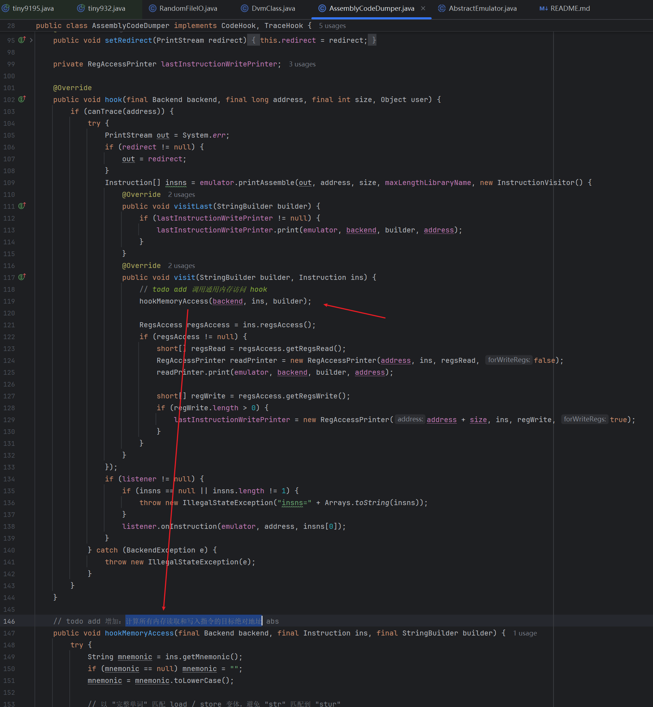

# Trace UI

[](LICENSE)
[]()
[](https://tauri.app)

高性能 ARM64 执行 trace 可视化分析工具。基于 Tauri 2 + React 构建的桌面应用，专为安全研究员设计，支持千万行或亿行级大规模 trace 的流畅浏览、函数调用树折叠、反向污点追踪、内存/寄存器实时查看等功能。


> 当前支持 [unidbg](https://github.com/zhkl0228/unidbg) 输出的 ARM64 指令级 trace。

## 特性亮点

- **大规模 Trace 浏览** — 虚拟滚动 + mmap 零拷贝，千万行 trace 流畅浏览，内存占用恒定
- **调用树折叠** — 自动识别 BL/BLR/RET 构建函数调用树，按层级折叠/展开，快速定位目标区域
- **反向污点追踪** — 从寄存器或内存地址反向切片追踪数据依赖，支持过滤和高亮两种模式
- **寄存器 & 内存面板** — 实时查看任意指令处的寄存器值和内存 Hex Dump，支持历史追溯
- **多窗口浮动面板** — 搜索、内存、污点状态等面板可独立浮出，支持多文件并行分析
- **DEF/USE 箭头连线** — 点击寄存器名即可可视化数据定义与使用关系，快速追踪值传播路径
- **高亮与注释** — 5 色高亮、删除线、隐藏行、行内注释，状态持久化到本地


## Looking for Contributors

如果你做过逆向分析，大概都经历过这种时刻：

- trace 日志几千万甚至上亿行
- 在文本里一行一行追数据流
- 在010editor里密密麻麻的指令日志，眼睛快瞎了

**Trace 是程序最真实的行为，** 但它也是最难分析的东西。

所以我写了这个工具：

> **一个高性能 ARM64 执行 Trace 可视化分析器**

希望在面对 **千万到亿行级指令规模的 trace** 时，不再只能依赖文本一行一行地硬看。

它不仅是一个查看器，也正在逐步加入：

- **脱离Unidbg trace依赖**

- **数据流 / 污点分析**
- **字符串**
- **表达式重建**
- **CFG**
- **算法识别、循环识别**
- **生成AI更容易理解的内容格式用于辅助还原**
- ...

帮助更轻松、更快速地理解程序的执行过程。

我希望有一天，当逆向工程师做trace日志分析时， 它会像 **Frida**、**JADX** 一样自然地被打开。

让 trace 分析从 **眼花缭乱**变成 **专注于理解程序执行逻辑**。

------

### Why Open Source

这样的工具，不可能一个人完成。

我希望把它做成一个真正有生命力的项目，最终成为 **逆向工程师工具链的一部分**。

------

### Who I'm Looking For

如果你：

- 热爱逆向工程
- 喜欢做工具
- 对 **trace / VM / 程序分析 / 可视化 / 性能优化** 感兴趣
- 有时间和精力

欢迎一起把它做成**逆向工程师的必备工具。**

Let's build it together.

联系我vx: landddding

---


## 功能详解

### 大规模 Trace 浏览

基于 mmap 内存映射 + 虚拟滚动实现，仅渲染可见区域的数十行，无论 trace 文件有多大，内存占用和渲染性能保持恒定。首次打开 2400 万行 trace 索引构建约 15 秒，构建完成后自动缓存，再次打开同一文件秒级加载。

支持文本搜索和正则表达式搜索（`/pattern/` 语法），搜索结果列表可点击跳转，支持 Ctrl+Alt+←/→ 导航历史前进/后退。

右侧 Minimap 缩略图可快速拖动定位。

### 调用树折叠


自动分析 `BL`/`BLR`（函数调用）和 `RET`（返回）指令，构建完整的函数调用树。左侧面板以树形结构展示调用层级，双击可跳转到对应函数入口。

在 trace 表格中，已识别的函数调用区域会显示折叠控件，点击可折叠/展开整个函数体，快速跳过不关心的代码区域。

### 反向污点追踪（Taint Analysis）


核心分析功能。指定一个或多个寄存器/内存地址作为污点源，工具会自动反向追踪所有数据依赖链，标记出影响该值的全部指令。


**两种查看模式：**

- **过滤模式（Filter）** — 仅显示与污点相关的行，大幅缩减视图


- **高亮模式（Highlight）** — 显示全部行，污点相关行以颜色高亮


污点追踪结果可导出为 TXT 或 JSON 格式。

### 寄存器面板


选中任意指令行时，左下方寄存器面板实时显示该指令处的完整寄存器状态（x0-x30、sp、pc、lr、nzcv）。

- 红色色标记：当前指令修改（DEF）的寄存器
- 蓝色标记：当前指令读取（USE）的寄存器
- 双击寄存器值可快速复制

### 内存面板


以 16 字节对齐的 Hex Dump 格式展示 trace 执行过程中的内存状态。

当选中包含内存操作的指令时，面板自动滚动到对应地址。右侧历史记录列出该地址的所有读写操作，点击可跳转到对应的 trace 行。

### 多窗口与浮动面板


搜索、内存、内存访问列表、污点状态等面板支持从主窗口"浮出"为独立窗口。浮动窗口与主窗口实时同步状态。

支持同时打开多个 trace 文件，每个文件拥有独立的污点追踪状态，互不干扰。

### DEF/USE 箭头连线


在 trace 表格中点击任意指令行的寄存器名，工具会自动查询该寄存器的 DEF/USE 链：向上箭头指向该寄存器值的**定义处**（DEF，最近一次写入该寄存器的指令），向下箭头指向所有**使用处**（USE，后续读取该寄存器值的指令）。

- 定义行（DEF）以绿色背景高亮
- 使用行（USE）以蓝色背景高亮
- 点击箭头标签可直接跳转到对应行
- 再次点击同一寄存器取消显示

配合污点追踪使用，可以快速追踪单个寄存器值在指令间的传播路径。

### 高亮与注释


- **颜色高亮**：5 种颜色（红/黄/绿/蓝/青），支持快捷键 Alt+1~5
- **删除线**：标记已分析或不相关的行
- **隐藏行**：批量隐藏选中行，隐藏位置显示指示器，可随时恢复
- **行内注释**：按 `;` 键为当前行添加自由文本注释

所有高亮和注释状态自动持久化到本地存储，关闭后重新打开不丢失。

## 快捷键

> macOS 下 `Ctrl` 替换为 `⌘`

| 快捷键 | 功能 |
|--------|------|
| `Ctrl+O` | 打开 trace 文件 |
| `Ctrl+F` | 打开/聚焦搜索面板 |
| `Ctrl+C` | 复制选中行 |
| `Ctrl+/` | 隐藏选中行 |
| `Ctrl+Alt+←` | 导航后退 |
| `Ctrl+Alt+→` | 导航前进 |
| `Ctrl+Enter` | 保存注释 / 确认对话框 |
| `G` | 跳转到指定行号/内存地址 |
| `;` | 为当前行添加注释 |
| `Alt+1~5` | 为选中行设置颜色高亮（红/黄/绿/蓝/青） |
| `Shift+Click` | 范围选择 |
| `Ctrl+Click` | 多选 |
| `Esc` | 关闭浮窗 / 取消选择 |

## 支持的 Trace 格式

当前支持 [unidbg](https://github.com/zhkl0228/unidbg) 输出的 ARM64 指令级 trace，每行格式形如：

```
[07:23:05 407][libtiny.so 0x6f8814] [ec8e5fb8] 0x406f8814: "ldr w12, [x23, #-8]!" ; mem[READ] abs=0x41688658 x23=0x41688660 => w12=0x16e80 x23=0x41688658

```

包含时间戳、PC 地址、SO 偏移、机器码、反汇编指令及寄存器值。

## 构建

### 环境要求

- [Rust](https://rustup.rs/) 1.75+
- [Node.js](https://nodejs.org/) 18+
- [Tauri CLI](https://tauri.app/)：`cargo install tauri-cli`

#### Unidbg格式适配说明

unidbg的日志格式我增加了计算所有内存读取和写入指令的目标绝对地址，所以大家在使用前需要对uinidbg中打印这些信息，否则格式不太一样可能造成bug，修改点位于文件：`src/main/java/com/github/unidbg/AssemblyCodeDumper.java`的`hook`方法中，这样在内存读写的指令时打印的格式是这样的：

- 内存读

```
[07:23:05 407][libtiny.so 0x6fc114] [295a69b8] 0x406fc114: "ldr w9, [x17, w9, uxtw #2]" ; mem[READ] abs=0x416885f0 x17=0x416885d4 w9=0x7 => w9=0x88bd0
```

- 内存写

```
[07:23:05 408][libtiny.so 0x6f87ac] [69692838] 0x406f87ac: "strb w9, [x11, x8]" ; mem[WRITE] abs=0x410c8bd0 w9=0x63 x11=0x41040000 x8=0x88bd0 => w9=0x63
```

abs是内存的绝对地址



`AssemblyCodeDumper.java`文件我放到项目里了，大家替换到自己的unidbg中即可

### 开发模式

```bash
./build.sh dev
```

Vite HMR + Rust 热重载，修改前端代码即时生效。

### Release 构建

```bash
./build.sh release
```

生成平台对应的安装包（Windows `.msi` / macOS `.dmg` / Linux `.deb`）。

## 技术架构

```
┌─────────────────────────────────────────────────┐
│                    Frontend                      │
│         React 19 + TypeScript + Vite             │
│                                                  │
│  ┌──────────┐ ┌──────────┐ ┌──────────────────┐ │
│  │TraceTable│ │ Function │ │ Memory/Register  │ │
│  │(Virtual  │ │   Tree   │ │     Panels       │ │
│  │Scrolling)│ │          │ │                  │ │
│  └────┬─────┘ └────┬─────┘ └───────┬──────────┘ │
│       │            │               │             │
│       └────────────┼───────────────┘             │
│                    │ Tauri IPC (invoke)           │
├────────────────────┼─────────────────────────────┤
│                    │                             │
│                 Backend                          │
│            Rust + Tauri 2                        │
│                                                  │
│  ┌──────────┐ ┌──────────┐ ┌──────────────────┐ │
│  │ LineIndex │ │  Taint   │ │   Phase2State    │ │
│  │(mmap+u64)│ │ Scanner  │ │ (CallTree/Mem/   │ │
│  │          │ │ & Slicer │ │  RegCheckpoints) │ │
│  └──────────┘ └──────────┘ └──────────────────┘ │
│                                                  │
│  ┌──────────────────────────────────────────────┐│
│  │           bincode Cache Layer                ││
│  └──────────────────────────────────────────────┘│
└─────────────────────────────────────────────────┘
```

**后端**：通过 mmap 零拷贝映射 trace 文件，一遍扫描生成依赖图、调用树、内存访问索引和寄存器检查点，全部通过 bincode 持久化缓存。污点切片采用 BFS 反向传播算法，在预构建的依赖图上完成。

**前端**：基于 @tanstack/react-virtual 实现虚拟滚动，Canvas 原生渲染实现 ARM64 语法高亮和 DEF→USE 箭头连线。多会话隔离设计，每个打开的文件拥有独立的分析状态。

## 常见问题

**Q: 首次打开大文件很慢？**

首次打开需要等待构建索引，构建完成后会自动缓存。再次打开同一文件可秒级加载。

**Q: 如何清除缓存？**

通过菜单 `文件 → 删除当前文件缓存` 清除，或手动删除缓存目录。

**Q: 支持哪些平台？**

Windows、macOS、Linux 均支持。macOS 和 Windows 已适配原生窗口控制风格。

**Q: 能否支持其他 trace 格式？**

当前仅支持 unidbg 格式。如需支持其他格式，欢迎提交 Issue 讨论。

## 许可证

[GPL-3.0](LICENSE)
